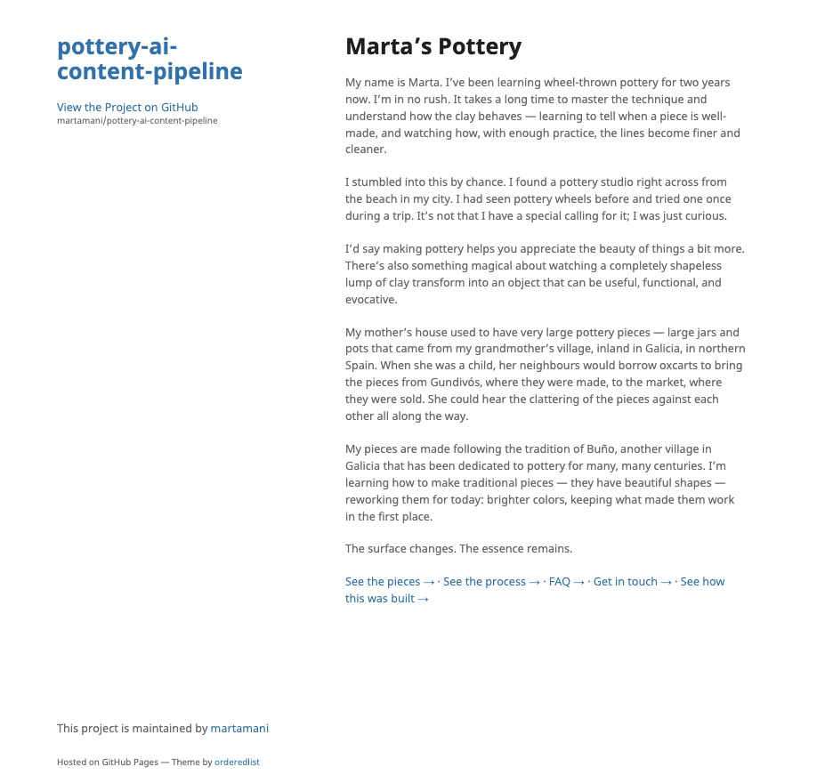
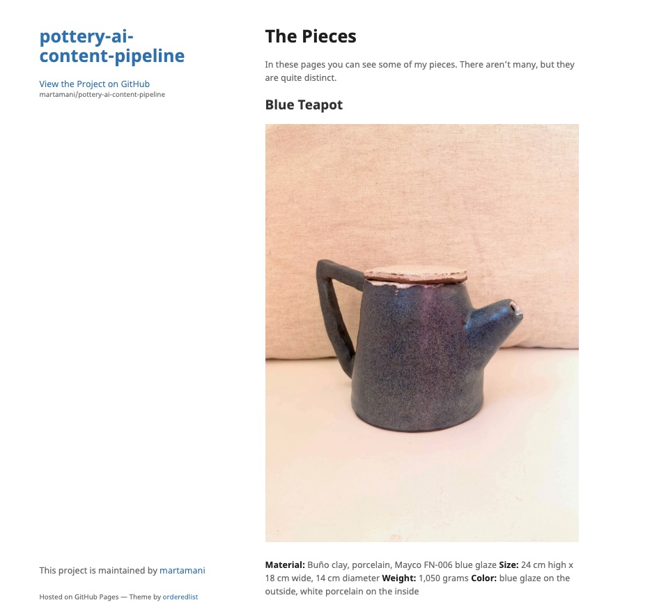
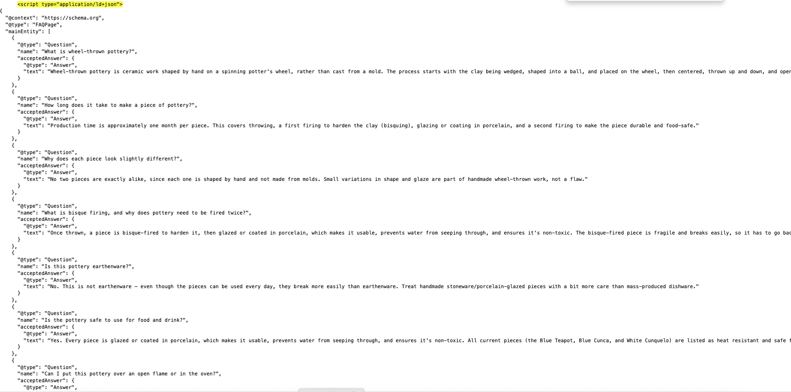
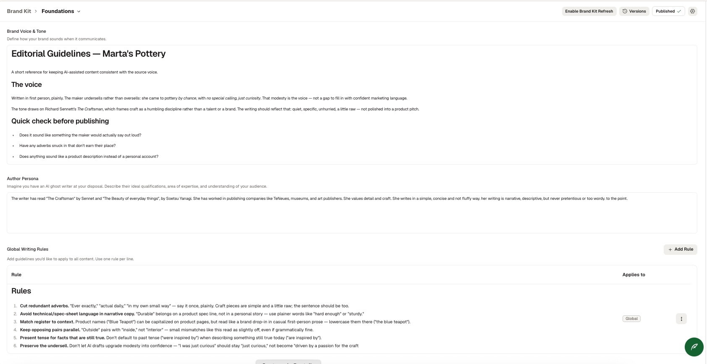
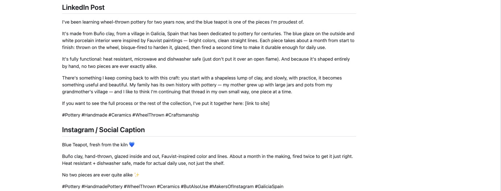
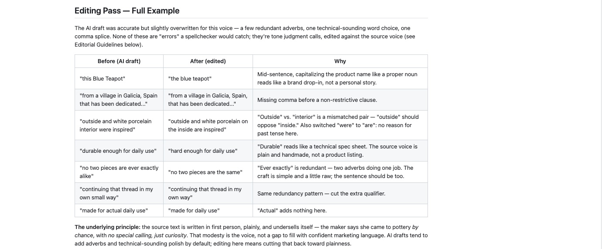
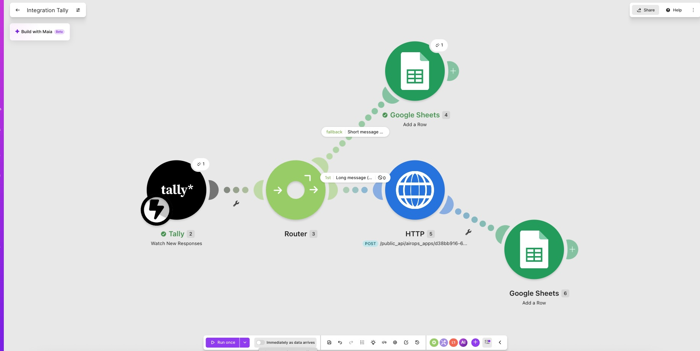
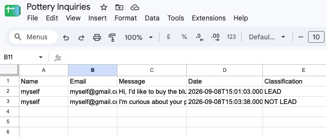
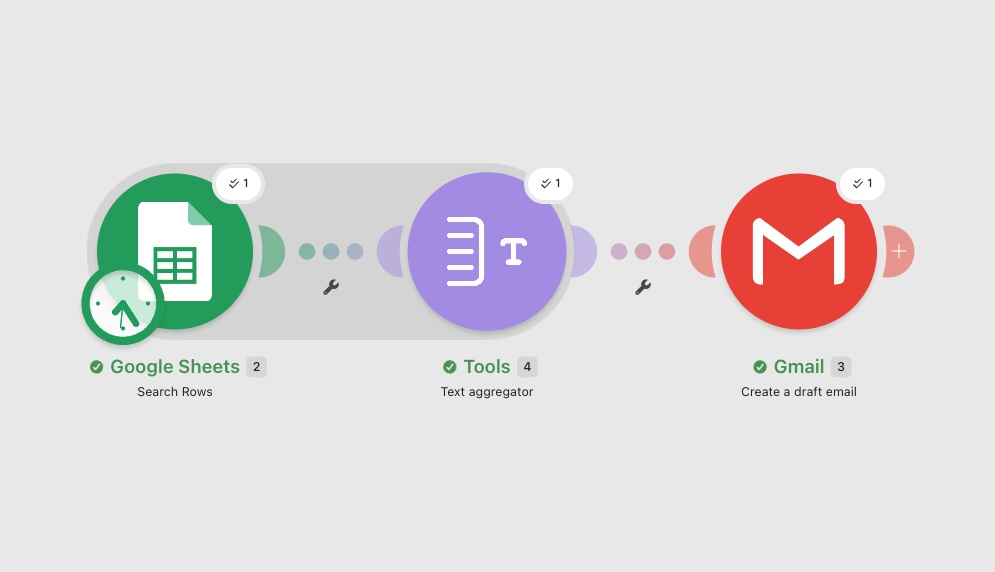
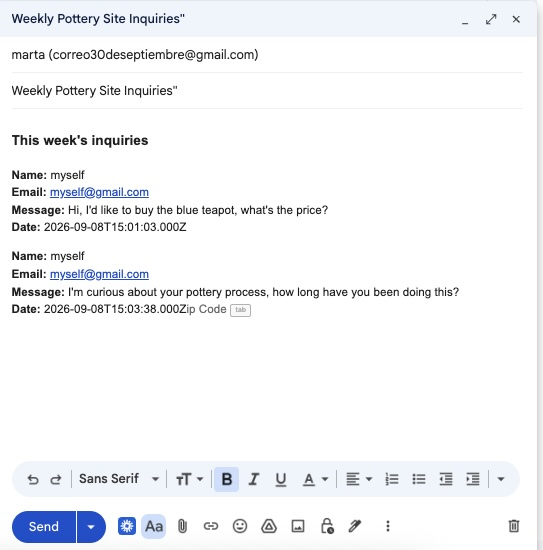

# AI content pipeline — case study

## What this is
An end-to-end AI content workflow for a small craft brand: research, generation, editing, GEO, publishing, repurposing, and inbound lead handling. Built to demonstrate the AI Content Editor workflow (research → draft → edit → publish → repurpose → orchestrate).

Live site: https://martamani.github.io/pottery-ai-content-pipeline/
Repo: https://github.com/martamani/pottery-ai-content-pipeline

## 1. Site and content
Built a static site (GitHub Pages) from real source material: homepage, product pages, process page. Source text written by the maker (Marta).

**Screenshot:** homepage and pieces page.

## 2. GEO layer
FAQ page generated via AirOps (Quill agent), grounded in the live site content. Quill flagged missing content instead of inventing an FAQ when the site was still offline — a real example of the tool refusing to hallucinate.

Added FAQPage schema (JSON-LD) to the FAQ page — structured data embedded in the page's HTML that spells out each question and its exact answer in a machine-readable format. Instead of an AI search engine parsing the visible text and guessing at what's being asked, it can read the schema directly and know precisely which text answers which question, making the content easier to cite accurately.

**Screenshot:** AirOps chat showing the "no content to draw from" flag. Screenshot of the FAQ page's JSON-LD schema (FAQPage type, live in page source).

## 3. Editorial guidelines
Wrote a brand voice styleguide, grounded in the source text's actual tone (plain, first-person, undersells rather than oversells; inspired by Richard Sennett's *The Craftsman*). Uploaded into AirOps's Brand Kit so future generations reference it.

**Screenshot:** editorial-guidelines.md, and the Brand Kit "Voice & Tone" field showing it pasted in.

## 4. Content repurposing
Same site content repurposed into a LinkedIn post and Instagram caption via AirOps.

**Screenshot:** AirOps output (LinkedIn + Instagram text).

## 5. Editing pass
Manually edited the AI-generated LinkedIn post against the styleguide: cut redundant adverbs, fixed a tense mismatch, corrected a mismatched word pair, adjusted capitalization for tone. Full before/after table in `repurposed-content.md`.

**Screenshot:** the before/after table.

## 6. Styleguide validation
Tested whether the Brand Kit styleguide actually influences new output: asked AirOps to generate care instructions using the stored voice guidelines. Output matched the intended tone (plain, no spec-sheet language).

**Screenshot:** care-instructions.md and the AirOps generation.

## 7. Contact form automation
Built a Tally contact form, wired to Make.com with conditional routing: messages over ~100 words route to a summarization step before reaching a weekly digest; shorter messages skip straight to the digest. Every submission — regardless of branch — is saved to a Google Sheet with a Lead/Not Lead classification and sent in a weekly email digest.

**What was attempted first:** an AirOps Workflow, triggered via AirOps's webhook API, to summarize long messages and classify intent using an LLM. The scenario was fully wired and tested — routing logic, JSON payload structure, webhook authentication all worked. External calls were blocked by an AirOps platform restriction: `"source API is not available on the free trial or free tier. Contact AirOps support for access."` This was confirmed on repeated tests, including after regenerating the workspace API key.

**Decision:** rather than pay for a tier upgrade to unlock one feature for a demo project, intent classification was rebuilt as a simple, transparent rule directly in Make.com: each message is checked for buying-intent keywords ("buy," "purchase," "price," "commission," "order") and tagged Lead or Not Lead accordingly, with the message text saved alongside it in the Sheet. Less sophisticated than an LLM judgment call, but free, fast, and auditable — a reasonable trade for this volume of inbound messages.

**A debugging note on the digest:** the weekly digest email initially came out blank. Google Sheets' "Search Rows" output turned out to be addressable only by numeric position (`{{2.`0`}}`, `{{2.`1`}}`...), not by the column-name labels shown in the interface (`Name`, `Email`) — a mismatch between what the UI displays and what the underlying data structure expects. A **Text Aggregator** module was added between Sheets and Gmail so multiple inquiries combine into one digest draft, rather than generating a separate draft per row.

**What works end to end today:** Tally → Make.com routing by message length → keyword-based Lead/Not Lead classification → Google Sheets (all submissions saved) → weekly digest scenario that aggregates every row into a single Gmail draft.

**Screenshots:**
- Make.com scenario canvas (Tally → Router → long/short branches → Google Sheets)
- The AirOps webhook error: `"source API is not available on the free trial or free tier"`
- Google Sheet showing rows with Lead/Not Lead classification
- Weekly digest scenario (Google Sheets → Text Aggregator → Gmail) and the combined digest draft
- Live "Get in touch" link on the site

## Next steps (not yet built)
- Revisit LLM-based intent classification (via AirOps or another provider) if inbound volume or nuance outgrows the keyword rule

